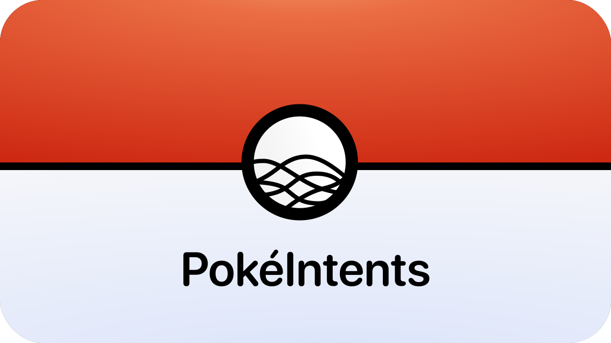
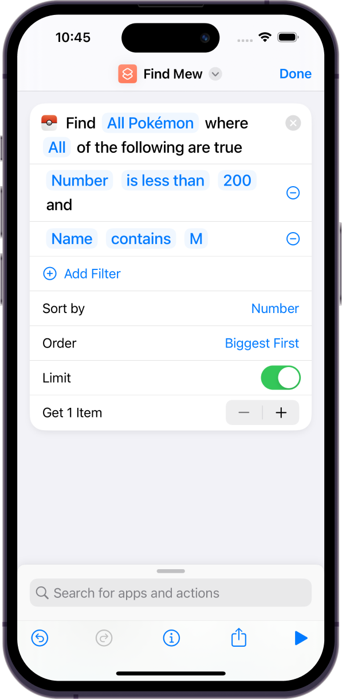
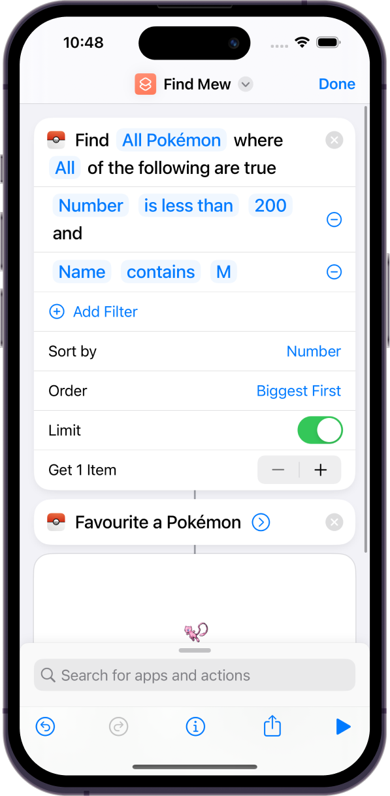
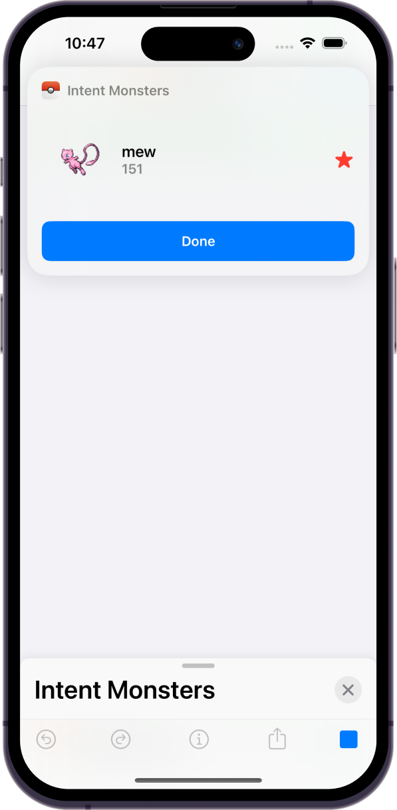
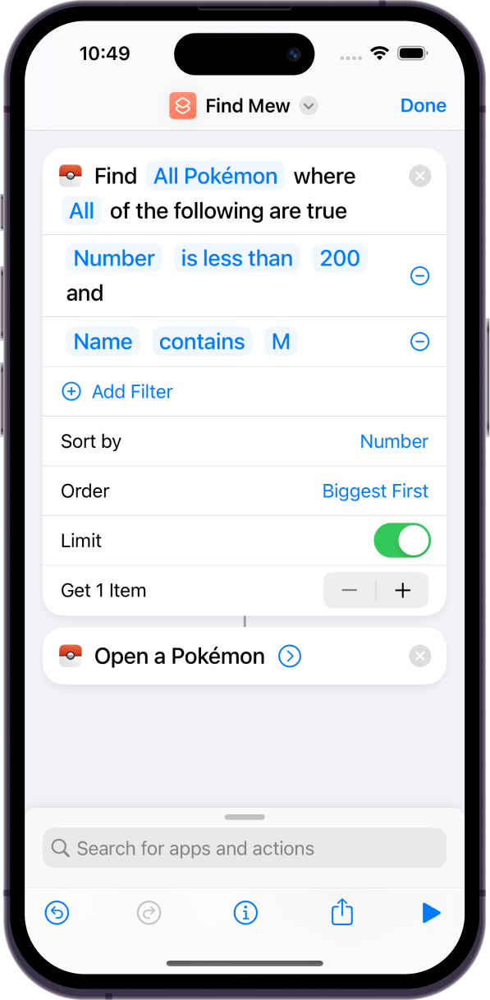
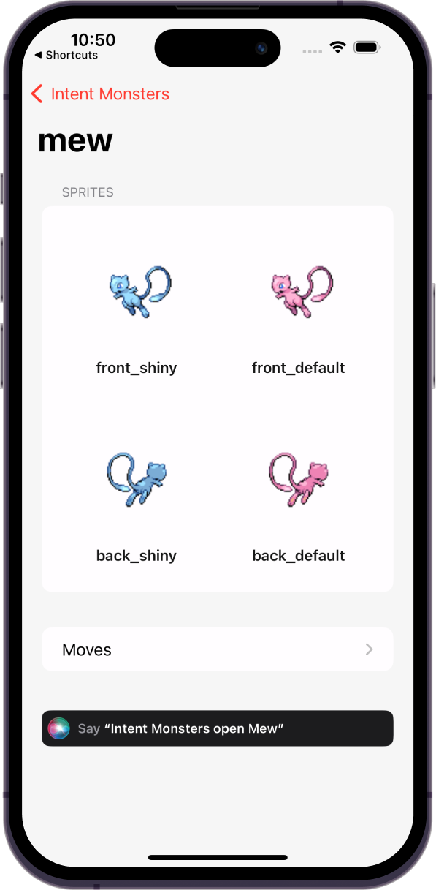
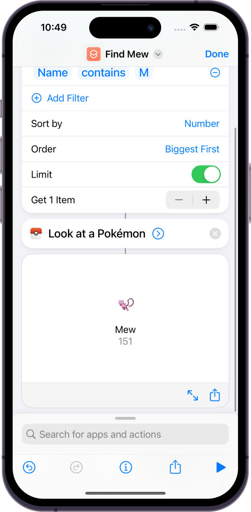
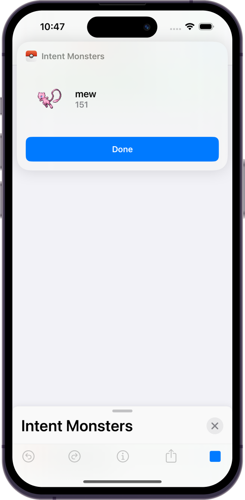

# PokéIntents

<p align="center">
  
</p>

An app to show a simple implmentation of Apple's [AppIntents](https://developer.apple.com/documentation/appintents) framework. It uses only local JSON for its data, and [UserDefaults](https://developer.apple.com/documentation/foundation/userdefaults) for persisting user favourites. The goal is to show using intents, not how to build a super fancy app.

If you have an idea for a feature to add, please open a PR! 😊

## Features

### Listing Pokémon

You can query Pokémon inside shortcuts using a couple of different queries. It supports limiting and sorting.

The mechanism for comparators is a custom solution with an enum for each, allowing it to be easily extended for future properties.

Checkout `PokemonQuery` for more.

<p align="right">
  
</p>

### Favourite/Unfavourite a Pokémon

Interacting with the user defaults is possible from the intents as they all run within your main apps container. You can favourite and unfavourite a pokemon directly from shortcuts.


<p align="right">


</p>


### Open with intents

On each pokemon page there's a Siri prompt to open that again with your voice. This is a simple solution using the latest NavigationStack api. This is also exposed to shortcuts.

<p align="right">


</p>


### Open without the app

You can use a shortcut to preview without opening the app. When you combine this with queries, it allows for entirely shortcut based viewing, to the point you may not even need to use the app.

<p align="right">


</p>

## Data

### Source
The data for this app was generated using this query on [pokeapi.co](https://pokeapi.co), and downloaded as a local JSON to avoid hitting someone elses API in sample code.

```graphql
query GenOneQuery {
  pokemon_v2_pokemon(where: {pokemon_species_id: {_lt: 152}}, distinct_on: pokemon_species_id) {
    id
    name
    pokemon_v2_pokemonsprites {
      sprites
    }
    pokemon_v2_pokemonmoves {
      pokemon_v2_move {
        name
      }
    }
  }
}
```

### Mapping

Mapping is quickly done using quicktype.io. There's some awkwardness with the sprites as they come down as a json string inside a json value, so we have to do some funky conversion to extract them. This is an area that could certainly be improved with a custom decoder.

---


<p align="center">
  
</p>